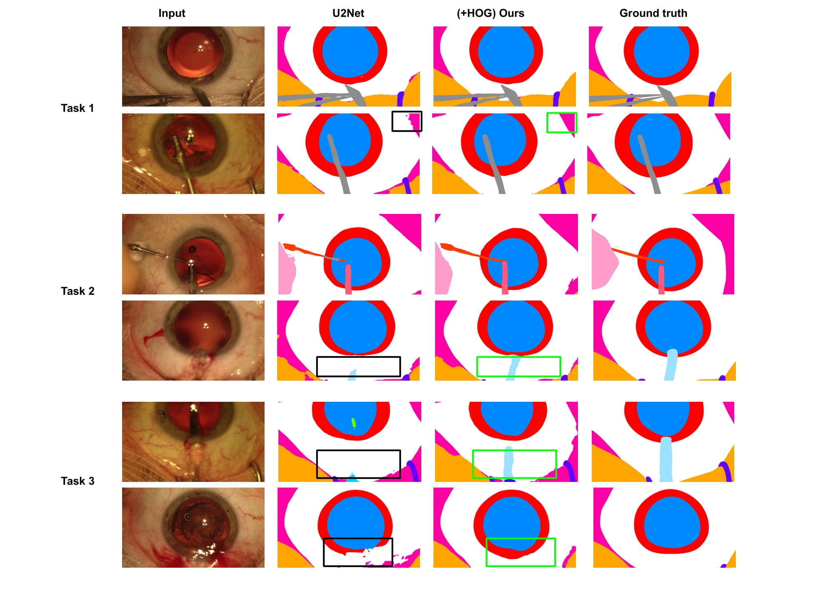
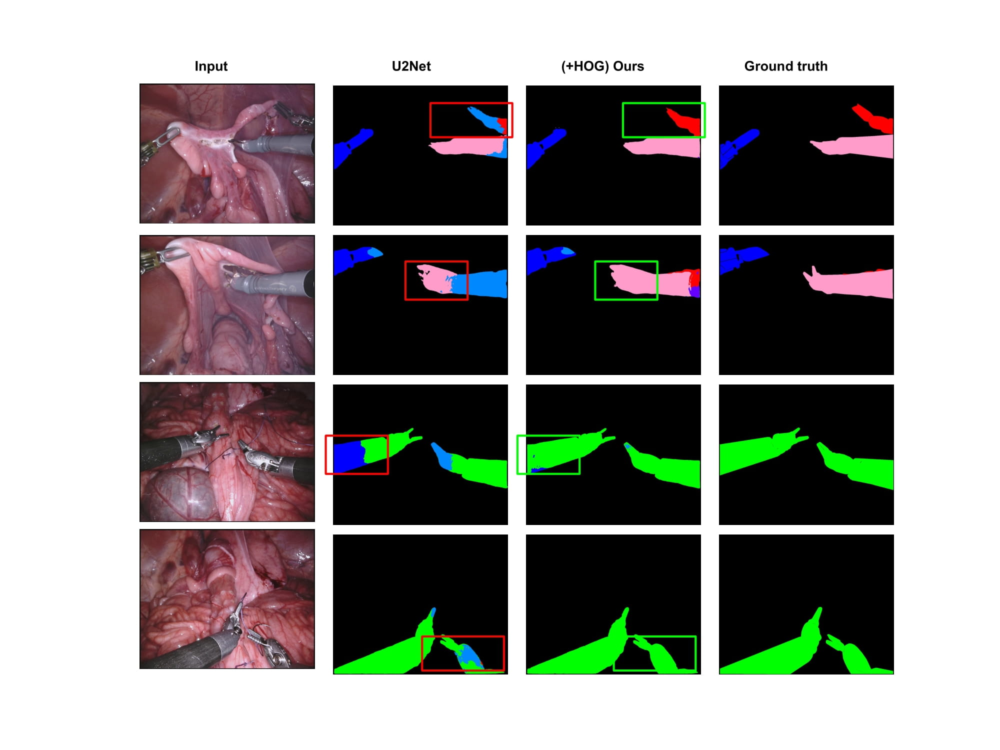

# Medical Image Semantic Segmentation

Official pytorch implementation of the paper **Histogram of Oriented Gradients Meet Deep Learning: A Novel Multi-task Deep Network for Medical Image Semantic Segmentation** \
This work presents a novel deep multi-task learning method for medical image segmentation leveraging Histogram of Oriented Gradients (HOGs) to generate pseudo-labels.

<p align="center"></p>

# Prerequisites

- Python 3.8
- PyTorch 1.8
- CUDA 10.1

# Installation

First of all, clone the repo:
```bash
    git clone https://github.com/thetna/medical_image_segmentation.git
```
All the required python packages can be installed with:
```bash
    cd medical_image_segmentation
    pip install -r requirements.txt
```


# Training

For training, first put training images and corresponding segmentation maps in separate directories and update the following information in the `Config/train.yml` file.

```
config/train.yml
├──  network    - Segmentation achitectures: UNet, UNet+HOG, U2Net, U2Net+HOG
│
├──  dataset    - Specify the datasets to use for training: Cadis, Robinst, Custom
│ 
├──  task       - Task number for Cadis or Robinst datasets: 1, 2, 3
│ 
├──  datasets 
│    └── train  - Training data configurations
│    └── valid  - Validation data configurations
│ 
├──  seg_net 
│    └── in_nc  - Input number of channels
│    └── out_nc - Output number of channels or total number of classes 
│    └── resume_path  - Path for checkpoint to resume from
│ 
├──  hog_decoder 
│    └── out_dim  - Dimension of HOG to use
│    └── resume_path  - Path for checkpoint to resume from
│
├──  train    - All other training parameters
```

Then start training with the following command:

```bash
    python train.py config/train.yml
```

# Inference

Download the pre-trained weights from [here](). Add the path of images and the models in the `config/test.yml`. Then run the following command:
```bash
    python test.py config/test.yml
```

# Results

<p align="center">Qualitative comparison between the proposed method with its counter-part architecture U2Net on three different tasks. First two rows represent examples from Task 1, the middle two rows, and the last two rows are examples from Task 2 and Task 3 respectively.
</p>


<p align="center">Qualitative comparison between before and after applying our method on U2Net in the Task 2 of robotic instrument segmentation challenge held in
MICCAI 2017.
</p>

# Citation 

@article{Bhattarai_2022_multitask,
    author    = {Bhattarai, Binod and Subedi, Ronast and Gaire, Rebati Raman and Vazquez, Eduard and Stoyanov, Danail},
    title     = {Histogram of Oriented Gradients Meet Deep Learning: A Novel Multi-task Deep Network for Medical Image Semantic Segmentation},
    journal = {arXiv:2204.01712},
    month     = {April},
    year      = {2022}
}
